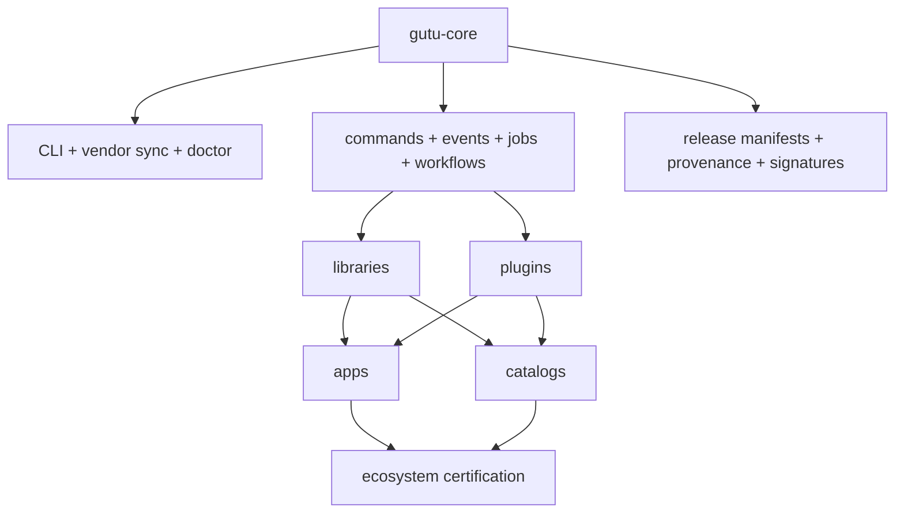
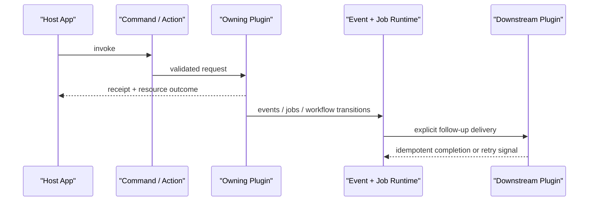

# Gutu Framework Overview

  

Gutu is a modular application framework ecosystem designed for teams that need strong domain boundaries, independent repositories, and explicit cross-plugin orchestration without giving up developer ergonomics.

## Executive Summary

| Question | Answer |
| --- | --- |
| What is Gutu? | A contract-first governed work OS made up of `gutu-core`, standalone plugins, optional operating-model packs, standalone libraries, app repos, catalogs, and certification tooling. |
| What does it optimize for? | Independent development, explicit runtime composition, truthful docs, and production-grade verification. |
| What is the main idea? | Keep shared runtime rules in `gutu-core`, keep domain ownership in plugins, keep reusable code in libraries, and make integration explicit through commands, events, jobs, and workflows. |

## What Gutu Solves

| Problem | Why It Hurts | Gutu Response |
| --- | --- | --- |
| Product logic grows into one oversized repo | Ownership, release cadence, and dependency reasoning all get muddy | Split core, plugins, libraries, apps, and catalogs by clear repo boundaries |
| Extension points are implicit | Hidden hooks are hard to test, debug, and migrate safely | Prefer manifests, typed actions/resources, commands, events, jobs, and workflows |
| Shared code becomes internal folklore | Teams copy utilities, fork patterns, and drift from docs | Publish libraries as first-class repos with focused APIs and verification |
| Ecosystem claims drift from reality | Docs become aspirational while CI only checks fragments | Treat docs, maturity, certification, and release truth as part of the product |

## Structural Model

| Layer | Owns | Example Outcome |
| --- | --- | --- |
| `gutu-core` | Runtime primitives, ecosystem metadata, CLI, release truth | Commands, events, jobs, lockfiles, vendor sync, release manifests |
| Libraries | Reusable contracts, UI foundations, communication helpers, AI/runtime utilities | `@platform/communication`, `@platform/ui-shell`, `@platform/contracts` |
| Plugins and packs | Domain ownership and operator/business surfaces | `notifications-core`, `booking-core`, `auth-core`, `workflow-core`, `issues-core`, `runtime-bridge-core`, `company-builder-core` |
| Apps | Product, docs, playground, and operator experiences | dev console, examples, docs site, playground |
| Catalogs and integration | Discoverability, maturity, compatibility, consumer proof | plugin catalog, library catalog, ecosystem certification |

## Ecosystem Topology

## Runtime Composition Model

Gutu’s preferred composition path is explicit:

1. A host or operator invokes a command or action.
2. The owning plugin validates input and mutates only its own domain boundary.
3. The plugin returns resource changes, lifecycle envelopes, and follow-up jobs where appropriate.
4. The runtime dispatches durable events, jobs, and workflows.
5. Other plugins react through declared subscriptions or command orchestration, not hidden hooks.

## Why Not Generic Hooks

| Hook-Heavy Model | Failure Mode | Gutu Alternative |
| --- | --- | --- |
| “Anyone can subscribe anywhere” | Ordering and side effects become difficult to reason about | Declare commands, resources, events, jobs, and workflows as first-class runtime contracts |
| Stringly typed callbacks | Tooling and docs cannot verify what is really supported | Use typed package exports, manifests, and schema-backed integration points |
| Hidden coupling in shared process memory | Refactors silently break downstream behavior | Plugin solver and compatibility metadata make dependencies explicit |

## Advantages Over Common Alternatives

| Alternative Pattern | What It Usually Gets Right | Where Gutu Improves |
| --- | --- | --- |
| Monolithic full-stack framework | Unified developer experience | Adds real repo independence and clearer ownership boundaries |
| Generic plugin platform | Easy extension surface | Replaces implicit magic with stronger operational contracts |
| Internal package collection | Reuse without one giant repo | Adds catalogs, maturity, compatibility channels, and certification |
| Service-everything architecture | Hard isolation | Keeps many workflows local and composable until true distribution is necessary |

## Developer Experience

| Workflow Need | Gutu Mechanism |
| --- | --- |
| Start a consumer workspace | `gutu init` plus vendor sync |
| Verify repo boundaries | `gutu doctor` |
| Prove split-repo compatibility | ecosystem certification and consumer smoke |
| Add domain capability | build a plugin repo with manifest contracts |
| Add reusable UI/runtime code | build a library repo and certify it with the ecosystem |

## Release And Certification Flow

## When Gutu Is A Strong Fit

- You want plugins and libraries to evolve as independent repos, not just folders.
- You need cross-plugin business orchestration but do not want a fragile hook bus.
- You want a governed work OS that can stay generic at the core while layering optional operating-model packs on top.
- You want collaboration and local-runtime ergonomics without giving up governed approvals, audit, and typed control-plane contracts.
- You care about release truth, documentation quality, and certification as part of framework quality.
- You want to keep domain ownership explicit even as AI, admin, and operator surfaces expand.

## Boundaries

- Gutu is not trying to hide every tradeoff behind automation; explicit contracts are preferred over convenience magic.
- It does not claim that every extracted repo is already at the same maturity level; maturity is documented per repo.
- It does not assume distributed microservices are always the answer; many workflows are better handled in one governed runtime first.
